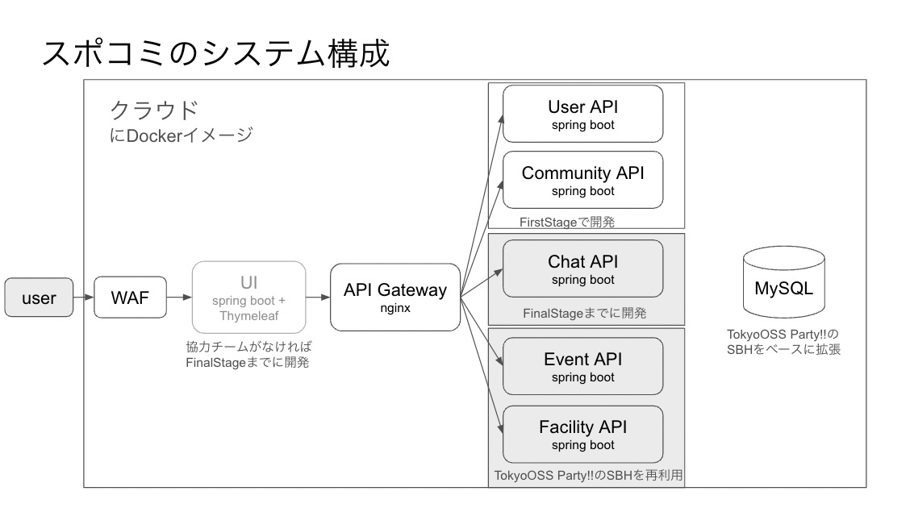
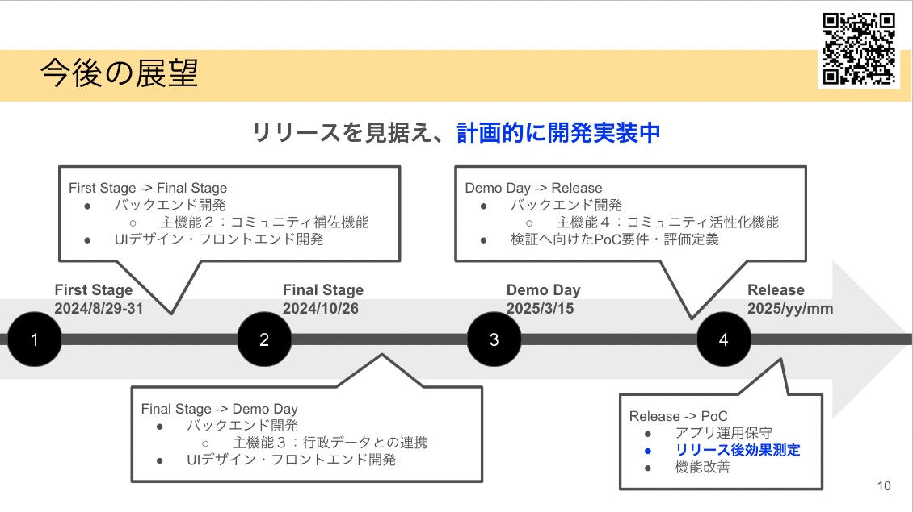

# スポコミ - コミュニティ活性化によるスポーツ実施率の向上

## 作品概要
- 私達は[都知事杯OpenDataHackathon2024](https://odhackathon.metro.tokyo.lg.jp/)で西東京市の[行政課題](https://odhackathon.metro.tokyo.lg.jp/issues/)「スポーツ相談窓口システムの機能拡充によるスポーツ実施率向上」に取り組みます。
- 西東京市が目指すスポーツ実施率70%を達成している国は、地域のスポーツコミュニティを活性化させるための体制を政策として実現しています。私達は身近な人達からなるスポーツを実施するスモールコミュニティを育成し、徐々につながっていくことで国全体にスポーツをするコミュニティネットワークを広げていく仕組み「スポコミ」を提案します。
- 作品の一部にTokyo OSS Party!!で作成したSports Barrier-free Hubの設備・備品貸出システムを取り入れ、行政の窓口や設備をHubにコミュニティ形成を促進させる構想です。

## 作品構成要素
| 構成要素       | 概要                                                                 | GitHub Repository                              |  デモ                     |
|----------------|----------------------------------------------------------------------|-----------------------------------------------|------------------------------|
| **sports-barrier-free-hub-2024odh**| コミュニティ機能を含む環境一式を構築する   |- [sports-barrier-free-hub-2024odh](https://github.com/dx-junkyard/sports-barrier-free-hub-2024odh) | （近日公開予定） |
| **api-community-spring**| コミュニティ管理・検索などの機能を提供する（新規作成）          |- [api-community-spring](https://github.com/dx-junkyard/api-community-spring) | （近日公開予定） |
| **sports-barrier-free-liff**| スポーツ窓口で備品貸出の手続きを簡単にするためのスマホアプリ（Tokyo OSS Party!!2023の作品を使用予定）   |- [sports-barrier-free-liff](https://github.com/dx-junkyard/sports-barrier-free-liff) | [TokyoOSS時のデモ](https://www.youtube.com/watch?v=5nZW4lGoQg0&t=1115s) |
| **api-facility-rental-spring**| 設備貸出機能を提供（Tokyo OSS Party!!2023の作品を使用予定）   |- [api-facility-rental-spring](https://github.com/dx-junkyard/api-facility-rental-spring) |（同上） |
| **api-equipment-rental-spring**| 備品貸出機能を提供（Tokyo OSS Party!!2023の作品を使用予定）   |- [api-equipment-rental-spring](https://github.com/dx-junkyard/api-equipment-rental-spring) |（同上） |
| **api-sportsevent-spring**| スポーツイベント管理機能を提供（Tokyo OSS Party!!2023の作品を使用予定）   |- [api-sportsevent-spring](https://github.com/dx-junkyard/api-sportsevent-spring) | （同上） |
| **sports-barrier-free-myql**| sports-barrier-free-mysql（Tokyo OSS Party!!2023の作品を改善中）   |- [sports-barrier-free-myql](https://github.com/dx-junkyard/sports-barrier-free-myql) | （同上） |

## 課題

## システム構成

## 作品のロードマップ

## コミュニティ参加のお誘い
dx-junkyardでは、技術共有やコラボレーションを通じて、互いに学び、支援し合うメンバーを募集しています。一緒に創造性と革新性に満ちた社会の実現に貢献しましょう。
[コミュニティ参加はこちらのフォームから](https://forms.gle/PVW4kYYh53SzbfdbA)

## 連絡先
OpenData Bridgeやデモ動画に関するご質問、その他のお問い合わせはこちらからお願いいたします。
[https://www.dx-junkyard.com/](https://www.dx-junkyard.com/)

