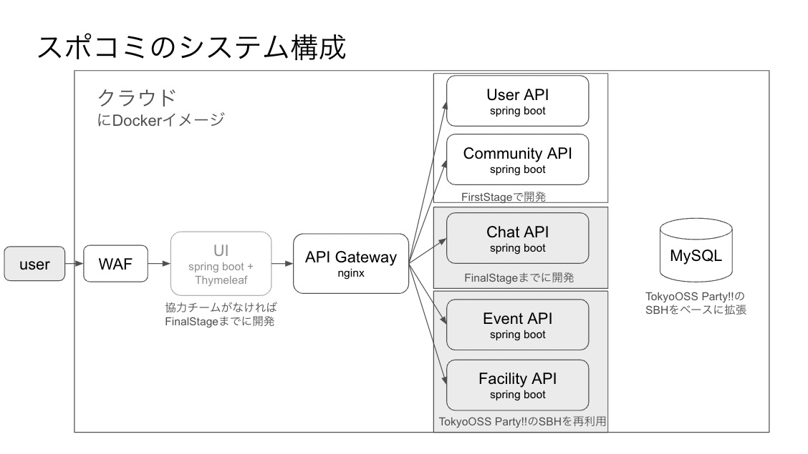
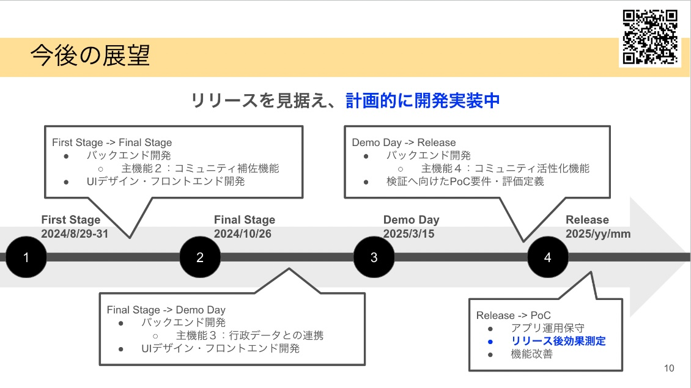

# スポコミ - コミュニティ活性化によるスポーツ実施率の向上

サービス紹介ページ: [OpenDataHackathon2024 Collection 92](https://odhackathon.metro.tokyo.lg.jp/collection/92/)

## 取り組む課題
- 私たちは [都知事杯 Open Data Hackathon 2024](https://odhackathon.metro.tokyo.lg.jp/) で、西東京市の行政課題  
  「**スポーツ相談窓口システムの機能拡充によるスポーツ実施率向上**」に取り組みます。

## 解決策
- スポーツ実施率が 70 % 前後に達している国々では、行政が地域スポーツコミュニティを政策として後押ししています。  
  私たちは、身近な仲間で構成される **スモールスポーツコミュニティ** を育成し、ゆるやかに連携させることで  
  全国にスポーツのネットワークを広げる仕組み **「スポコミ」** を提案します。

- 「[一般成人における運動・スポーツの実施頻度と促進・阻害要因との関係](https://webpages.ihs.kyushu-u.ac.jp/ktsm/journals/souki_koukai-2023-04-21.pdf)」では、  
  運動習慣の有無により成人を **習慣群／不定期実施群／未実施群** に分類し、  
  特に **不定期実施群と未実施群** の実施率向上には *周囲からの社会的支援（口コミ）* が有効と指摘されています。  

  スポコミでは次のアプローチで三つの層すべてを巻き込み、運動を継続しやすい環境を整えます。特に習慣群が不定期実施群と未実施群を巻き込み、新しいスポーツを始める環境を整える仕組みが重要であると考え、力を入れました。  

  1. **習慣群** : 「道具をそろえる」「メンバーを集める」などの手間をアプリで解消し、誘いやすさを向上。  
  2. **不定期実施群／未実施群** : 口コミ感覚で参加できる “お誘い導線” を設計し、心理的ハードルを低減。  

### 作品構成要素
| 構成要素 | 概要 | GitHub Repository | 備考 |
| --- | --- | --- | --- |
| **spocomi-frontend** | コミュニティ情報の検索・閲覧を行うフロントエンド | [spocomi-frontend](https://github.com/dx-junkyard/spocomi-frontend) |  |
| **api-community-spring** | コミュニティ管理・検索 API | [api-community-spring](https://github.com/dx-junkyard/api-community-spring) |  |
| **spocomi-mysql** | API が利用する MySQL 定義 | [spocomi-mysql](https://github.com/dx-junkyard/spocomi-mysql) |  |

## システム構成

## 作品のロードマップ

## dx-junkyard参加のお誘い
dx-junkyardでは、技術共有やコラボレーションを通じて、互いに学び、支援し合うメンバーを募集しています。一緒に創造性と革新性に満ちた社会の実現に貢献しましょう。
[コミュニティ参加はこちらのフォームから](https://forms.gle/PVW4kYYh53SzbfdbA)

## 連絡先
スポコミやデモ動画に関するご質問、その他のお問い合わせはこちらからお願いいたします。
[https://www.dx-junkyard.com/](https://www.dx-junkyard.com/)

